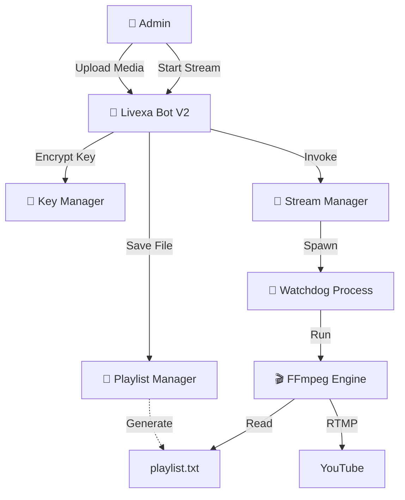

<div align="center">

# 🔴 Livexa | Enterprise Streaming Automation V2
### The Telegram-Controlled YouTube Live Engine


[](https://www.redhat.com/en/technologies/cloud-computing/openshift/virtualization)
[](https://www.centos.org/)
[](https://www.python.org/)
[]()

**Author:** [Yogeshwar Kumar](https://github.com/inyogeshwar) &nbsp;|&nbsp;
**Bot:** [@LivexaBot](https://t.me/LivexaBot) &nbsp;|&nbsp;
**YouTube:** [inyogeshwar_official](https://www.youtube.com/@inyogeshwar_official) &nbsp;|&nbsp;
**Instagram:** [in_yogeshwar](https://instagram.com/in_yogeshwar)

</div>

---

## 📋 Table of Contents
- [About Livexa V2](#-about-livexa-v2)
- [New Features](#-new-features-v2)
- [Architecture](#-architecture)
- [Installation](#-installation)
- [Configuration](#-configuration)
- [Usage Guide](#-usage-guide)
- [Security Model](#-security-model)

---

## 💡 About Livexa V2

**Livexa V2** is the ultimate upgrade to the Telegram-based streaming automation system. It removes all need for SSH or manual file management after installation. 

**You can now build playlists, upload media (MP3/MP4), manage stream keys, and control multiple broadcasts entirely from your phone.**

---

## 🚀 New Features (V2)

### 📂 Multi-Playlist System
*   Create unlimited playlists directly from Telegram.
*   **Upload Media:** Send MP3s or MP4s to the bot, and it auto-saves them to the selected playlist.
*   **Granular Control:** Delete specific files or wipe entire playlists via Inline Buttons.

### 🔑 Key Manager
*   Store multiple YouTube Stream Keys securely.
*   Give them aliases (e.g., "Main Channel", "Gaming Channel").
*   Switch keys instantly before starting a stream.

### 📱 Zero-CLI Management
*   **No FileZilla:** Upload media via Telegram.
*   **No Nano:** Edit config via buttons.
*   **No Terminal:** Start/Stop/Reboot via bot.

---

## 🏗 Architecture



---

## 📦 Installation

### Prerequisites
*   CentOS Stream 9 / Ubuntu 20.04+
*   Python 3.9+
*   Root Access

### ⚡ Quick Start

1.  **Clone the Repository**
    ```bash
    git clone https://github.com/inyogeshwar/livexa-telegram-automation.git
    cd livexa-telegram-automation
    ```

2.  **Run Installer**
    ```bash
    chmod +x install.sh
    sudo ./install.sh
    ```

3.  **Start Service**
    ```bash
    systemctl start livexa-bot
    ```

---

## 🔧 Configuration

### 1. Secrets (First Run Only)
Edit `/opt/livexa/config/livexa.env`:
```ini
LIVEXA_BOT_TOKEN_PLAIN=123456...
LIVEXA_ADMIN_IDS=123456789
```

### 2. Everything Else
**Do it in Telegram!** No more config editing.

---

## 📱 Usage Guide

### 1️⃣ Create a Playlist
1.  Run `/start` -> **📂 My Playlists**.
2.  Click **➕ Create New Playlist**.
3.  Type a name (e.g., `ChillVibes`).

### 2️⃣ Upload Media
1.  Go to **📂 My Playlists** -> Select `ChillVibes`.
2.  **Just send audio/video files** to the chat.
3.  Bot confirms: "✅ Saved to ChillVibes".

### 3️⃣ Add Stream Key
1.  Run `/start` -> **🔑 Stream Keys**.
2.  Click **➕ Add New Key**.
3.  Enter Alias (e.g., `Gaming`) -> Enter Key (`rtmp://...`).

### 4️⃣ Go Live
1.  Click **▶ Start Stream**.
2.  Select Playlist (`ChillVibes`).
3.  Select Key (`Gaming`).
4.  Bot replies: **✅ SUCCESS: Stream is LIVE!**

---

## 🔐 Security Model

*   **AES-256 Encryption:** All stream keys stored in `storage/keys.json` are encrypted at rest.
*   **Admin Whitelist:** Only IDs in `LIVEXA_ADMIN_IDS` can access the bot.
*   **Input Sanitization:** File uploads are checked for safety.

---

## 📄 License

**© 2026 Yogeshwar Kumar.**
[GitHub](https://github.com/inyogeshwar) | [YouTube](https://www.youtube.com/@inyogeshwar_official)
