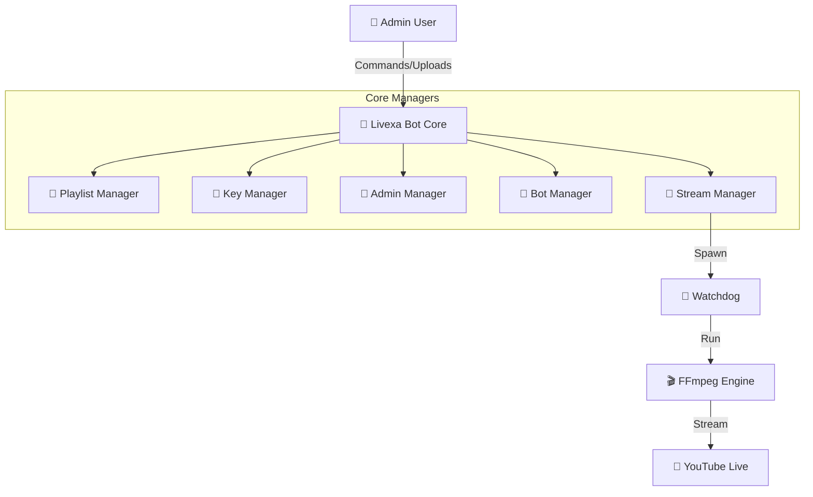

<div align="center">

# 🔴 Livexa | Enterprise Streaming V3
### The 100% Telegram-Controlled Broadcasting System


[](https://www.redhat.com/en/technologies/cloud-computing/openshift/virtualization)
[](https://www.centos.org/)
[]()

**Author:** [Yogeshwar Kumar](https://github.com/inyogeshwar) &nbsp;|&nbsp;
**Bot:** [@LivexaBot](https://t.me/LivexaBot)

</div>

---

## ⚡ V3: The Zero-CLI Revolution
**You no longer need a computer to manage this system.** After the 1-time install, `ssh` is history. 

*   **Single Message UI**: A persistent app-like dashboard in Telegram.
*   **Media Upload**: Send MP3/MP4 files to the bot -> Auto-added to playlist.
*   **Dynamic Security**: Add/Remove Admins and Bot Tokens via buttons.
*   **Encryption**: All keys and tokens are AES-256 encrypted.
*   **Auto-Resume**: Bot remembers state even after server reboots.

---

## 🏗 Architecture



---

## 📦 Installation

### Prerequisites
*   CentOS Stream 9 / Ubuntu 20.04+
*   Python 3.9+
*   Root Access

### 1. Install
```bash
git clone https://github.com/inyogeshwar/livexa-telegram-automation.git
cd livexa-telegram-automation
sudo ./install.sh
```

### 2. Configure (Once)
Edit `/opt/livexa/config/livexa.env`:
```ini
LIVEXA_BOT_TOKEN_PLAIN=123456...
LIVEXA_ADMIN_IDS=123456789
```

### 3. Start
```bash
systemctl start livexa-bot
```

**🚀 DONE. Close your terminal. Open Telegram.**

---

## 📱 User Guide (Tele-Op)

### 🔴 The Control Center
Send `/start` to summon the dashboard. It persists forever.

| Feature | Action |
| :--- | :--- |
| **Go Live** | Click `▶ START LIVE` -> Select Playlist -> Select Key |
| **Stop** | Click `⏹ STOP LIVE` |
| **Playlists** | Create new, view contents, or delete. |
| **Uploads** | **Just send files!** Select a playlist, then drag-and-drop MP3/MP4/Images into the chat. |
| **Keys** | Add multiple YouTube Stream Keys with aliases. |
| **Admins** | Authorize new team members by sending their Telegram ID. |

---

## 🔐 Security

*   **AES-256**: Key storage (`storage/keys.json`, `storage/bots.json`) is encrypted.
*   **Whitelist**: Only IDs in `storage/admins.json` can interact.
*   **Silent Fail**: Unauthorized users get no reponse.

---

## 📄 License

**© 2026 Yogeshwar Kumar.**
[GitHub](https://github.com/inyogeshwar) | [YouTube](https://www.youtube.com/@inyogeshwar_official)
